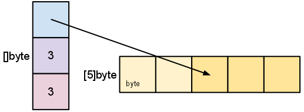

## Go Slices: usage and internals

https://blog.golang.org/slices-intro

### 介绍

Go 的 slice 类型为处理类型化数据序列提供了一种方便而有效的方法。分片类似于其他语言中的数组，但有一些不同寻常的特性。本文将介绍什么是切片以及如何使用它们。

### 数组

分片类型是建立在Go的数组类型之上的一种抽象，所以要理解分片，我们必须先理解数组。

数组类型定义指定了长度和元素类型。例如，类型 [4]int 表示一个由四个整数组成的数组。数组的大小是固定的，它的长度是其类型的一部分（[4]int 和 [5]int 是不同的、不兼容的类型）。数组可以用通常的方式进行索引，所以表达式 s[n] 是访问从零开始的第n个元素。

```go
var a [4]int
a[0] = 1
i := a[0]
// i == 1
```

数组不需要显式初始化，数组的零值是一个可以直接使用的数组，其元素本身是置零的：

```go
// a[2] == 0, the zero value of the int type
```

[4]int的内存表示是四个整数值线性排列：


Go的数组是数值。一个数组变量表示整个数组；它不是指向第一个数组元素的指针（在 C 语言中是这样）。这意味着，当您分配或传递一个数组值时，您将复制它的内容。(为了避免复制，你可以传递一个指向数组的指针，但那是指向数组的指针，而不是数组）。有一种方法可以把数组看作是一种结构，但它是有索引而不是命名字段：一个固定大小的复合值。

可以像这样指定一个数组文字:

```go
b := [2]string{"Penn", "Teller"}
```

或者，你可以让编译器为你计算数组元素:

```go
b := [...]string{"Penn", "Teller"}
```

在这两种情况下，b的类型都是 [2]string 。

### Slices

数组有它们的位置，但它们有点不灵活，所以你在 Go 代码中不太常见。不过，Slices却无处不在。它们建立在数组的基础上，提供了强大的功能和便利。

分片的类型规范是 []T，其中T是分片元素的类型。与数组类型不同，分片类型没有指定的长度。

分片文字的声明就像数组文字一样，只是省略了元素数:

```
letters := []string{"a", "b", "c", "d"}
```

可以用内置函数make创建切片，它的签名是：

```go
func make([]T, len, cap) []T
```

其中T代表要创建的分片的元素类型。make函数需要类型、长度和可选的容量。调用时，make会分配一个数组并返回一个指向该数组的分片:

```go
var s []byte
s = make([]byte, 5, 5)
// s == []byte{0, 0, 0, 0, 0}
```

当省略capacity参数时，它默认为指定的长度。下面是相同代码的一个更简洁的版本:

```go
s := make([]byte, 5)
```

使用内置的 length 和 capacity 函数可以检查切片的长度和容量：

```go
len(s) == 5
cap(s) == 5
```

接下来的两节将讨论长度和容量之间的关系。

分片的零值是nil。len 和cap 函数都会对nul分片返回0。

分片也可以通过 "切片" 现有的分片或数组来形成。切片是通过指定一个半开放的范围，用冒号隔开两个指数来完成的。例如，表达式 b[1:4] 创建了一个包含b元素1到3的分片（生成的分片的指数为0到2）。

```go
b := []byte{'g', 'o', 'l', 'a', 'n', 'g'}
// b[1:4] == []byte{'o', 'l', 'a'}, sharing the same storage as b
```

分片表达式的 start 和 end 指数是可选的，它们分别默认为零和分片的长度：

```go
// b[:2] == []byte{'g', 'o'}
// b[2:] == []byte{'l', 'a', 'n', 'g'}
// b[:] == b
```

这是创建一个给定数组的分片的语法：

```go
x := [3]string{"Лайка", "Белка", "Стрелка"}
s := x[:] // a slice referencing the storage of x
```

### 切片内部

分片是数组段的描述符，它由指向数组的指针、段的长度和它的容量（段的最大长度）组成。


我们前面通过 make([]byte，5) 创建的变量s，结构是这样的:


长度是指分片指针所指的元素数。容量是底层数组中的元素数（从分片指针所指的元素开始）。在接下来的几个例子中，长度和容量之间的区别将变得很清楚。

当我们分片时，观察分片数据结构的变化以及它们与底层数组的关系:

```go
s = s[2:4]
```


分片并不复制分片的数据，而是创建一个指向原始数组的新分片值。它创建一个新的分片值，指向原始数组。这使得分片操作与操作数组索引一样高效。因此，修改重新分片的元素（不是分片本身）会修改原始分片的元素:

```go
d := []byte{'r', 'o', 'a', 'd'}
e := d[2:]
// e == []byte{'a', 'd'}
e[1] = 'm'
// e == []byte{'a', 'm'}
// d == []byte{'r', 'o', 'a', 'm'}
```

刚才我们把s切成了比它的容量短的长度。我们可以通过再次将s切成片来增长它的容量:

```
s = s[:cap(s)]
```



分片的增长不能超过其容量。试图这样做会引起运行时的恐慌(panic)，就像在分片或数组的边界之外索引一样。同样，不能将分片重新分割到零以下以访问数组中的早期元素。

### 增长切片（copy和append函数）

要增加一个分片的容量，必须创建一个新的、更大的分片，并将原来分片的内容复制到其中。这种技术是其他语言的动态数组在幕后实现的工作方式。下一个例子通过创建一个新的分片t，将s的内容复制到t中，然后将分片值t赋给s，从而使s的容量增加一倍。

```go
t := make([]byte, len(s), (cap(s)+1)*2) // +1 in case cap(s) == 0
for i := range s {
        t[i] = s[i]
}
s = t
```

这个常用操作的循环部分，通过内置的copy函数变得更加简单。顾名思义，copy将数据从一个源片复制到一个目标片。它返回复制的元素数量：

```go
func copy(dst, src []T) int
```

copy函数支持在不同长度的切片之间进行复制（它将只复制到较小数量的元素）。此外，copy还可以处理共享同一个底层数组的源片和目的片，正确处理重叠的分片。

使用copy，我们可以简化上面的代码片段：

```go
t := make([]byte, len(s), (cap(s)+1)*2)
copy(t, s)
s = t
```

一个常见的操作是将数据追加到一个分片的末尾。这个函数将字节元素追加到一个字节分片上，如果需要的话，会增加分片，并返回更新后的分片值：

```go
func AppendByte(slice []byte, data ...byte) []byte {
    m := len(slice)
    n := m + len(data)
    if n > cap(slice) { // if necessary, reallocate
        // allocate double what's needed, for future growth.
        newSlice := make([]byte, (n+1)*2)
        copy(newSlice, slice)
        slice = newSlice
    }
    slice = slice[0:n]
    copy(slice[m:n], data)
    return slice
}
```

可以这样使用AppendByte：

```go
p := []byte{2, 3, 5}
p = AppendByte(p, 7, 11, 13)
// p == []byte{2, 3, 5, 7, 11, 13}
```

像AppendByte这样的函数很有用，因为它们提供了对分片生长方式的完全控制。根据程序的特性，可能需要以较小或较大的分片进行分配，或者对重新分配的大小设置一个上限。

但大多数程序不需要完全控制，所以Go提供了一个内置的append函数，对大多数目的都很好，它的签名是：

```go
func append(s []T, x ...T) []T
```

append函数将元素x追加到分片s的末尾，如果需要更大的容量，则增长分片：

```go
a := make([]int, 1)
// a == []int{0}
a = append(a, 1, 2, 3)
// a == []int{0, 1, 2, 3}
```

要将一个分片附加到另一个分片上，请使用...将第二个参数扩展为一个参数列表：

```go
a := []string{"John", "Paul"}
b := []string{"George", "Ringo", "Pete"}
a = append(a, b...) // equivalent to "append(a, b[0], b[1], b[2])"
// a == []string{"John", "Paul", "George", "Ringo", "Pete"}
```

由于分片的零值(nil)就像一个零长度的分片，所以你可以声明一个分片变量，然后在循环中追加到它：

```go
// Filter returns a new slice holding only
// the elements of s that satisfy fn()
func Filter(s []int, fn func(int) bool) []int {
    var p []int // == nil
    for _, v := range s {
        if fn(v) {
            p = append(p, v)
        }
    }
    return p
}
```

### 一个可能的 "疑难杂症"

如前所述，重新切割一个分片并不会对底层数组进行复制。完整的数组将被保留在内存中，直到它不再被引用。偶尔，这可能会导致程序在只需要一小块数据的时候，将所有数据保存在内存中。

例如，这个FindDigits函数将一个文件加载到内存中，并在内存中搜索第一组连续的数字数字，将它们作为一个新的分片返回。

```go
var digitRegexp = regexp.MustCompile("[0-9]+")

func FindDigits(filename string) []byte {
    b, _ := ioutil.ReadFile(filename)
    return digitRegexp.Find(b)
}
```

这段代码的行为很明确，但是返回的 []字节 指向一个包含整个文件的数组。由于分片引用了原来的数组，所以只要分片被保留在周围，垃圾收集器就不能释放数组；文件的几个有用字节将整个内容保留在内存中。

为了解决这个问题，可以在返回之前将感兴趣的数据复制到一个新的分片中：

```go
func CopyDigits(filename string) []byte {
    b, _ := ioutil.ReadFile(filename)
    b = digitRegexp.Find(b)
    c := make([]byte, len(b))
    copy(c, b)
    return c
}
```

这个函数的一个更简洁的版本可以通过使用append来构建。这是留给读者的一个练习。

### 进一步阅读

Effective Go包含了对切片和数组的深入处理，Go语言规范定义了切片及其相关的帮助函数。

## Slides in Effective Go

https://golang.org/doc/effective_go.html#slices

https://bingohuang.gitbooks.io/effective-go-zh-en/content/08_Data.html

切片通过对数组进行封装，为数据序列提供了更通用、强大而方便的接口。 除了矩阵变换这类需要明确维度的情况外，Go 中的大部分数组编程都是通过切片来完成的。

切片保存了对底层数组的引用，若你将某个切片赋予另一个切片，它们会引用同一个数组。 若某个函数将一个切片作为参数传入，则它对该切片元素的修改对调用者而言同样可见， 这可以理解为传递了底层数组的指针。

因此，Read 函数可接受一个切片实参 而非一个指针和一个计数；切片的长度决定了可读取数据的上限。以下为 os 包中 File 类型的 Read 方法签名:

```go
func (file *File) Read(buf []byte) (n int, err error)
```

该方法返回读取的字节数和一个错误值（若有的话）。若要从更大的缓冲区 b 中读取前 32 个字节，只需对其进行切片即可：

```go
    n, err := f.Read(buf[0:32])
```

这种切片的方法常用且高效。若不谈效率，以下片段同样能读取该缓冲区的前 32 个字节：

```go
var n int
var err error
for i := 0; i < 32; i++ {
   nbytes, e := f.Read(buf[i:i+1])  // Read one byte.
   n += nbytes
   if nbytes == 0 || e != nil {
      err = e
      break
   }
}
```

只要切片不超出底层数组的限制，它的长度就是可变的，只需将它赋予其自身的切片即可。 切片的容量可通过内建函数 cap 获得，它将给出该切片可取得的最大长度。 以下是将数据追加到切片的函数。若数据超出其容量，则会重新分配该切片。返回值即为所得的切片。 该函数中所使用的 len 和 cap 在应用于 nil 切片时是合法的，它会返回 0.

```go
func Append(slice, data []byte) []byte {
    l := len(slice)
    if l + len(data) > cap(slice) {  // reallocate
        // Allocate double what's needed, for future growth.
        newSlice := make([]byte, (l+len(data))*2)
        // The copy function is predeclared and works for any slice type.
        copy(newSlice, slice)
        slice = newSlice
    }
    slice = slice[0:l+len(data)]
    copy(slice[l:], data)
    return slice
}
```

最终我们必须返回切片，因为尽管 Append 可修改 slice 的元素，但切片自身（其运行时数据结构包含指针、长度和容量）是通过值传递的。

向切片追加东西的想法非常有用，因此有专门的内建函数 append。 要理解该函数的设计，我们还需要一些额外的信息，我们将稍后再介绍它。

### 二维切片

Go 的数组和切片都是一维的。要创建等价的二维数组或切片，就必须定义一个数组的数组， 或切片的切片，就像这样：

```go
type Transform [3][3]float64  // A 3x3 array, really an array of arrays.
type LinesOfText [][]byte     // A slice of byte slices.
```

由于切片长度是可变的，因此其内部可能拥有多个不同长度的切片。在我们的 LinesOfText 例子中，这是种常见的情况：每行都有其自己的长度。

```go
text := LinesOfText{
	[]byte("Now is the time"),
	[]byte("for all good gophers"),
	[]byte("to bring some fun to the party."),
}
```

有时必须分配一个二维数组，例如在处理像素的扫描行时，这种情况就会发生。 我们有两种方式来达到这个目的。一种就是独立地分配每一个切片；而另一种就是只分配一个数组， 将各个切片都指向它。采用哪种方式取决于你的应用。若切片会增长或收缩， 就应该通过独立分配来避免覆盖下一行；若不会，用单次分配来构造对象会更加高效。 以下是这两种方法的大概代码，仅供参考。首先是一次一行的：

```go
// 分配顶层切片。
picture := make([][]uint8, YSize) // 每 y 个单元一行。
// 遍历行，为每一行都分配切片
for i := range picture {
    picture[i] = make([]uint8, XSize)
}
```

现在是一次分配，对行进行切片：

```go
// 分配顶层切片，和前面一样。
picture := make([][]uint8, YSize) // 每 y 个单元一行。
// 分配一个大的切片来保存所有像素
pixels := make([]uint8, XSize*YSize) // 拥有类型 []uint8，尽管图片是 [][]uint8.
// 遍历行，从剩余像素切片的前面切出每行来。
for i := range picture {
    picture[i], pixels = pixels[:XSize], pixels[XSize:]
}
```


## Go语言规范中的Slice

https://golang.org/ref/spec#Slice_types

分片是针对一个底层数组的连续段的描述符，它提供了对该数组内有序序列元素的访问。分片类型表示其元素类型的数组的所有分片的集合。元素的数量被称为分片长度，且不能为负。未初始化的分片的值为 `nil` 。

```
SliceType = "[", "]", ElementType .
```

分片 `s` 的长度可以被内置函数 len来发现；和数组不同的是，这个长度可能会在执行过程中改变。元素可以被从 `0` 索引到 `len(s) - 1` 的整数所寻址到。一个给定元素的分片索引可能比其底层数组的相同元素的索引要小。

分片一旦初始化便始终关联到存放其元素的底层数组。因此分片会与其数组和其它相同数组的分片共享存储区；相比之下，不同的数组总是代表不同的存储区域。

分片底层的数组可以延伸超过分片的末端。 *容量* 便是对这个范围的测量：它是分片长度和数组内除了该分片以外的长度的和；不大于其容量长度的分片可以从原始分片再分片新的来创建。分片 `a` 的容量可以使用内置函数 [cap(a)](https://moego.me/golang_spec.html#cap-a) 来找到。

对于给定元素类型 `T` 的新的初始化好的分片值的创建是使用的内置函数 make，它需要获取分片类型、指定的长度和可选的容量作为参数。使用 `make` 创建的分片总是分配一个新的隐藏的数组给返回的分片值去引用。也就是，执行

```
make([]T, length, capacity)
```

就像分配个数组然后再分片它一样来产生相同的分片，所以如下两个表达式是相等的:

```
make([]int, 50, 100)
new([100]int)[0:50]
```

如同数组一样，分片总是一维的但可以通过组合来构造高维的对象。数组间组合时，被构造的内部数组总是拥有相同的长度；但分片与分片（或数组与分片）组合时，内部的长度可能是动态变化的。此外，内部分片必须单独初始化。